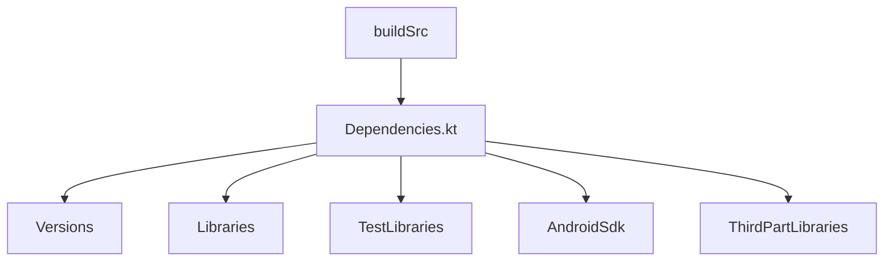

# Andorid Template Part 1 DSL Only

Android project template with empy activity and layout. Configured with Kotlin DSL

# buildSrc
buildSrc folder contains Dependencies.kt file. Manage dependencies from here

## Usage in build.gradle.kts

DSL give autocompletion support for gradle files
e.g *`implementation(Libraries.kotlinStdLib)`*
where `Libraries` is `object` in `Dependencies.kt`

## Difference between .kts and .build

SmartyPants converts ASCII punctuation characters into "smart" typographic punctuation HTML entities. For example:

|                |ASCII                          |HTML                         |
|----------------|-------------------------------|-----------------------------|
|implementation|`include ':app', ':data', ':framework'`            |`include**(":app", ":framework", ":data")`            |
|Plugins          |`apply plugin: 'com.android.application'`            |`plugins{id("com.android.application")}`            |